# Performance history

Measured on every push to `main` by `.github/workflows/perf.yml`; this branch is written by CI only.
JS and CSS sizes are gzip. Timings are medians of 3 loads on a shared runner without a GPU, so watch their trend, not single values.

Latest: [`8207497`](https://github.com/AxelUser/maltsev.space/commit/82074970b873cbeacc29789684fed2b91a72d153) chore: migrated to sveltekit 3.4 (#37) (2026-11-25). 11 runs recorded.

## Latest

| Page | Device | Upfront JS | Total JS | Total JS vs [`69649a6`](https://github.com/AxelUser/maltsev.space/commit/69649a642adf9e85fa19759bfed421bfd278cee2) | LCP | Blocking time |
|---|---|--:|--:|--:|--:|--:|
| Home | desktop | 143.3 KB | 144.4 KB | +18.7 KB | 72 ms | 0 ms |
| Home | mobile | 143.3 KB | 144.4 KB | +18.7 KB | 140 ms | 29 ms |
| Blog index | desktop | 143.2 KB | 144.3 KB | +21.4 KB | 100 ms | 0 ms |
| Blog index | mobile | 143.2 KB | 144.3 KB | +21.4 KB | 172 ms | 29 ms |
| About | desktop | 144.6 KB | 145.7 KB | +21.5 KB | 72 ms | 0 ms |
| About | mobile | 144.6 KB | 145.7 KB | +21.5 KB | 152 ms | 18 ms |
| Misc | desktop | 142.6 KB | 143.6 KB | +19.8 KB | 60 ms | 52 ms |
| Misc | mobile | 142.6 KB | 143.6 KB | +19.8 KB | 108 ms | 369 ms |
| Misc collection | desktop | 142.8 KB | 143.9 KB | +21.0 KB | 60 ms | 52 ms |
| Misc collection | mobile | 142.8 KB | 143.9 KB | +21.0 KB | 100 ms | 361 ms |
| Post | desktop | 149.3 KB | 151.8 KB | +23.2 KB | 72 ms | 0 ms |
| Post | mobile | 149.3 KB | 151.8 KB | +23.2 KB | 120 ms | 23 ms |
| Post with live cover | desktop | 149.3 KB | 306.9 KB | +28.6 KB | 84 ms | 309 ms |
| Post with live cover | mobile | 149.3 KB | 166.5 KB | +28.0 KB | 216 ms | 144 ms |
| Post with diagrams | desktop | 149.3 KB | 166.2 KB | −144.5 KB | 88 ms | 0 ms |
| Post with diagrams | mobile | 149.3 KB | 166.2 KB | −144.5 KB | 200 ms | 128 ms |
| 404 | desktop | 113.9 KB | 150.4 KB | −75.6 KB | 92 ms | 0 ms |
| 404 | mobile | 113.9 KB | 150.4 KB | −75.6 KB | 244 ms | 29 ms |

## Trends (last 11 runs)

### Home

```mermaid
xychart-beta
  title "Home: total JS, desktop (KB gzip)"
  x-axis ["69649a6", "0a1b7f2", "9e09f34", "1417e72", "29f4656", "5fc530f", "016b41c", "55bd02f", "12c3009", "57176e7", "8207497"]
  y-axis "KB" 0 --> 167
  line [125.6, 125.7, 125.7, 124.7, 124.7, 124.9, 124.9, 125.2, 125.4, 125.2, 144.4]
```

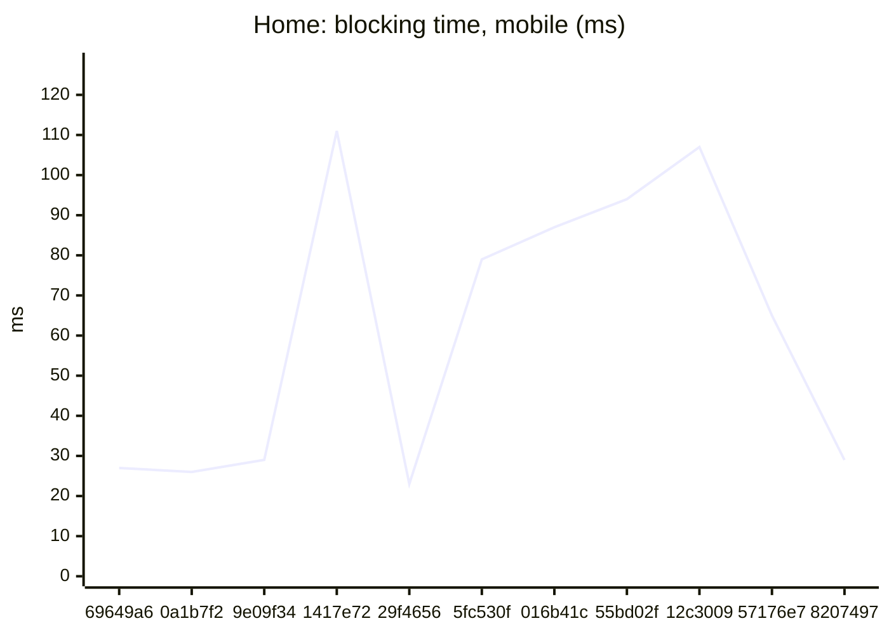
```mermaid
xychart-beta
  title "Home: blocking time, mobile (ms)"
  x-axis ["69649a6", "0a1b7f2", "9e09f34", "1417e72", "29f4656", "5fc530f", "016b41c", "55bd02f", "12c3009", "57176e7", "8207497"]
  y-axis "ms" 0 --> 128
  line [27, 26, 29, 111, 23, 79, 87, 94, 107, 65, 29]
```

### Blog index

```mermaid
xychart-beta
  title "Blog index: total JS, desktop (KB gzip)"
  x-axis ["69649a6", "0a1b7f2", "9e09f34", "1417e72", "29f4656", "5fc530f", "016b41c", "55bd02f", "12c3009", "57176e7", "8207497"]
  y-axis "KB" 0 --> 166
  line [123, 123, 123, 122.1, 122.1, 121.9, 121.9, 122.2, 122.4, 122.2, 144.3]
```

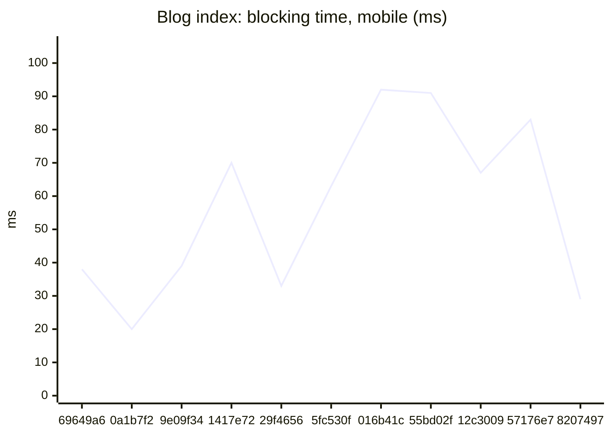
```mermaid
xychart-beta
  title "Blog index: blocking time, mobile (ms)"
  x-axis ["69649a6", "0a1b7f2", "9e09f34", "1417e72", "29f4656", "5fc530f", "016b41c", "55bd02f", "12c3009", "57176e7", "8207497"]
  y-axis "ms" 0 --> 106
  line [38, 20, 39, 70, 33, 63, 92, 91, 67, 83, 29]
```

### About

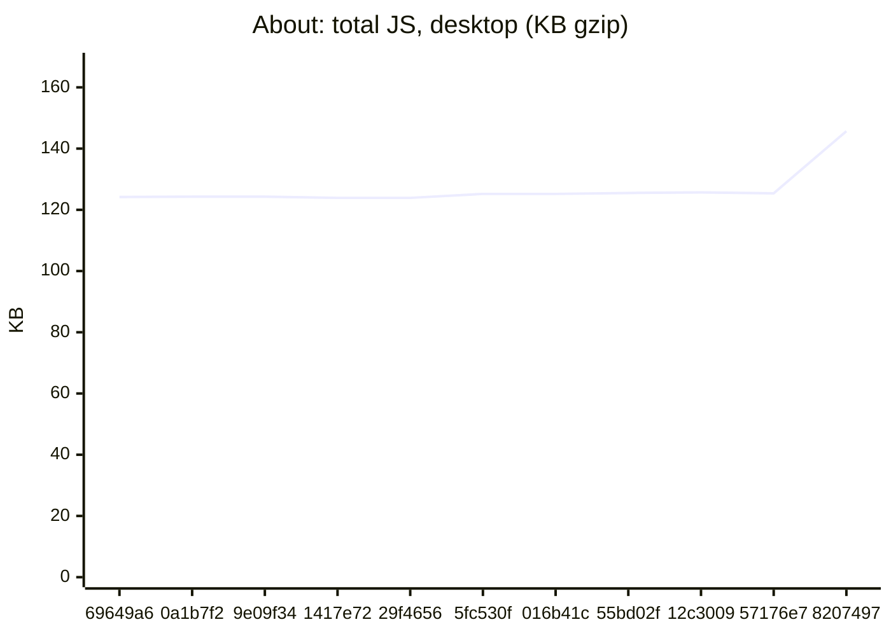
```mermaid
xychart-beta
  title "About: total JS, desktop (KB gzip)"
  x-axis ["69649a6", "0a1b7f2", "9e09f34", "1417e72", "29f4656", "5fc530f", "016b41c", "55bd02f", "12c3009", "57176e7", "8207497"]
  y-axis "KB" 0 --> 168
  line [124.2, 124.3, 124.3, 123.9, 123.9, 125.2, 125.2, 125.5, 125.7, 125.4, 145.7]
```

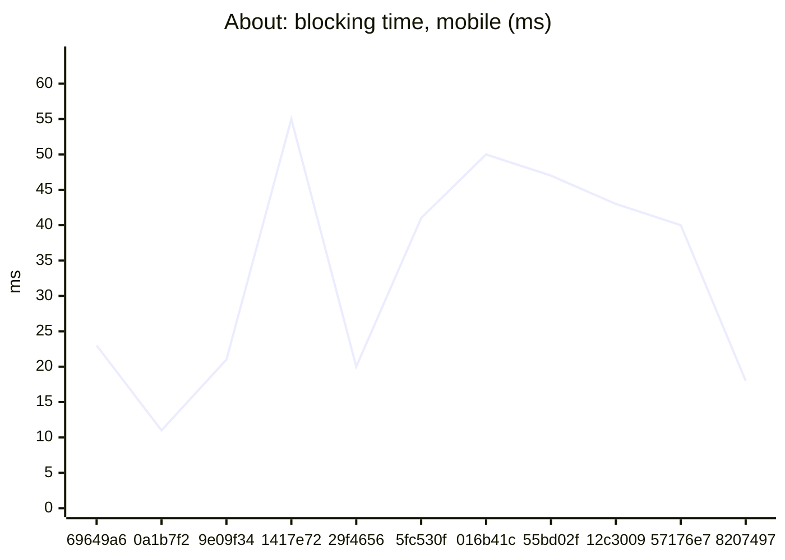
```mermaid
xychart-beta
  title "About: blocking time, mobile (ms)"
  x-axis ["69649a6", "0a1b7f2", "9e09f34", "1417e72", "29f4656", "5fc530f", "016b41c", "55bd02f", "12c3009", "57176e7", "8207497"]
  y-axis "ms" 0 --> 64
  line [23, 11, 21, 55, 20, 41, 50, 47, 43, 40, 18]
```

### Misc

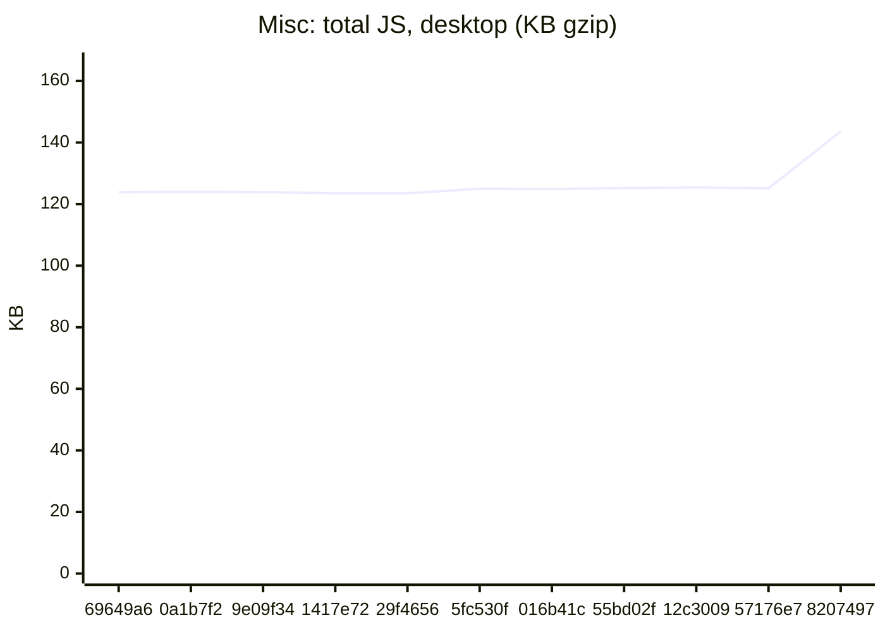
```mermaid
xychart-beta
  title "Misc: total JS, desktop (KB gzip)"
  x-axis ["69649a6", "0a1b7f2", "9e09f34", "1417e72", "29f4656", "5fc530f", "016b41c", "55bd02f", "12c3009", "57176e7", "8207497"]
  y-axis "KB" 0 --> 166
  line [123.9, 124, 123.9, 123.5, 123.5, 125, 124.9, 125.2, 125.4, 125.1, 143.6]
```

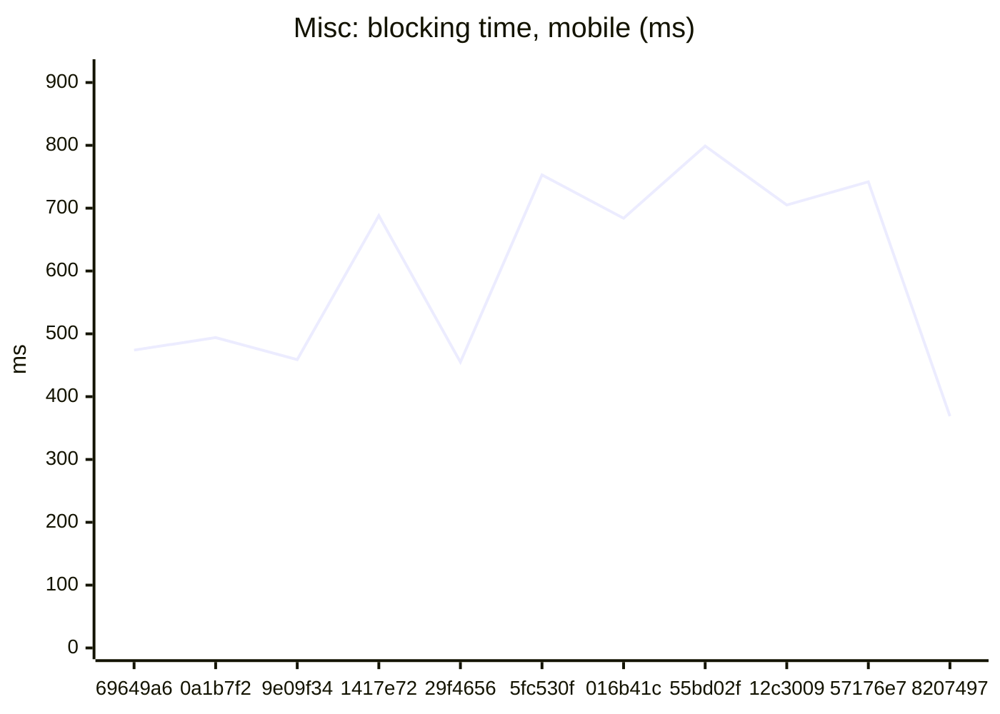
```mermaid
xychart-beta
  title "Misc: blocking time, mobile (ms)"
  x-axis ["69649a6", "0a1b7f2", "9e09f34", "1417e72", "29f4656", "5fc530f", "016b41c", "55bd02f", "12c3009", "57176e7", "8207497"]
  y-axis "ms" 0 --> 919
  line [474, 494, 459, 688, 455, 753, 684, 799, 705, 742, 369]
```

### Misc collection

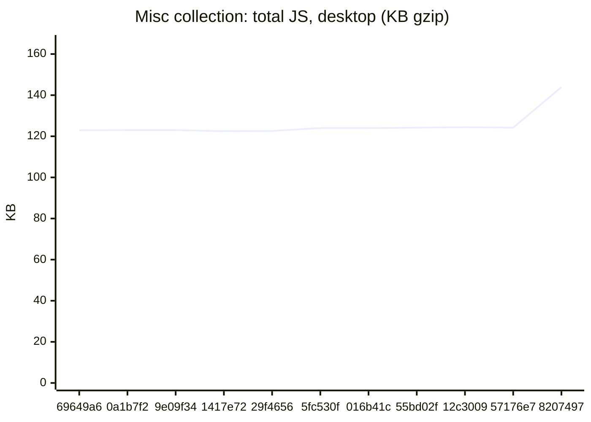
```mermaid
xychart-beta
  title "Misc collection: total JS, desktop (KB gzip)"
  x-axis ["69649a6", "0a1b7f2", "9e09f34", "1417e72", "29f4656", "5fc530f", "016b41c", "55bd02f", "12c3009", "57176e7", "8207497"]
  y-axis "KB" 0 --> 166
  line [122.9, 123, 123, 122.5, 122.6, 124, 124, 124.2, 124.4, 124.2, 143.9]
```

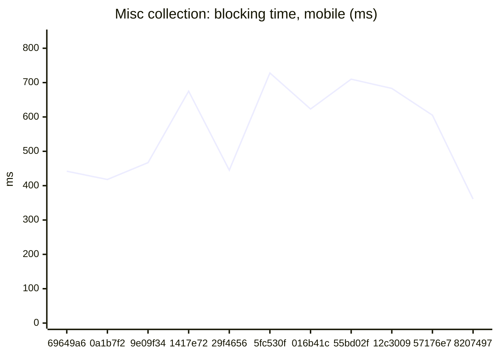
```mermaid
xychart-beta
  title "Misc collection: blocking time, mobile (ms)"
  x-axis ["69649a6", "0a1b7f2", "9e09f34", "1417e72", "29f4656", "5fc530f", "016b41c", "55bd02f", "12c3009", "57176e7", "8207497"]
  y-axis "ms" 0 --> 838
  line [442, 418, 467, 675, 445, 728, 623, 710, 683, 605, 361]
```

### Post

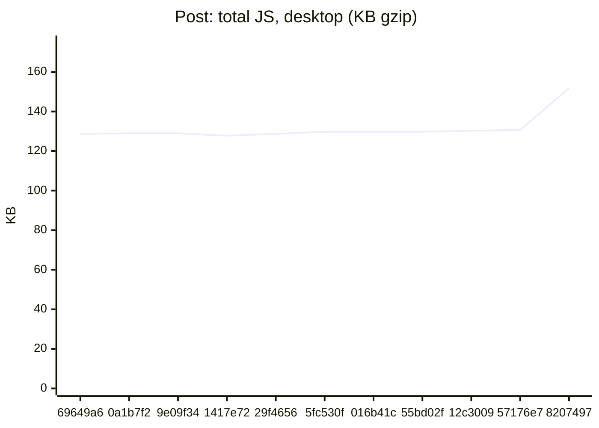
```mermaid
xychart-beta
  title "Post: total JS, desktop (KB gzip)"
  x-axis ["69649a6", "0a1b7f2", "9e09f34", "1417e72", "29f4656", "5fc530f", "016b41c", "55bd02f", "12c3009", "57176e7", "8207497"]
  y-axis "KB" 0 --> 175
  line [128.7, 129, 129, 127.8, 128.7, 129.8, 129.8, 129.8, 130.3, 130.7, 151.8]
```

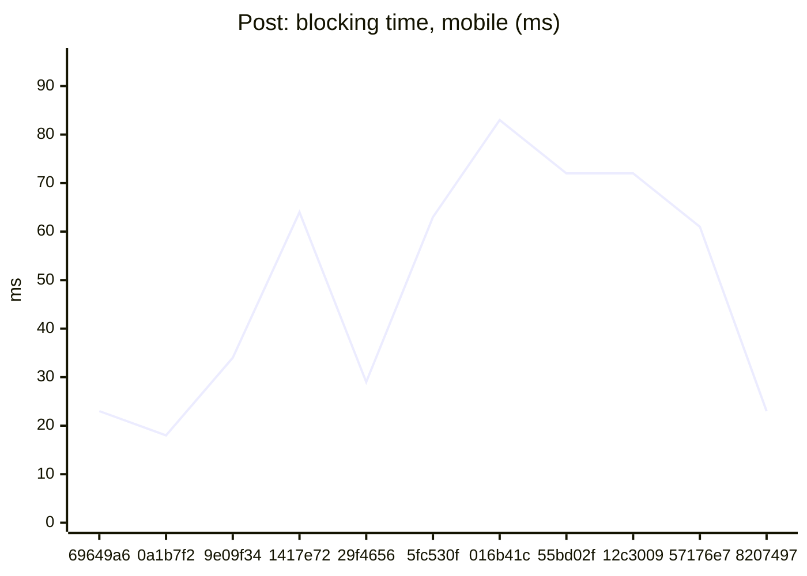
```mermaid
xychart-beta
  title "Post: blocking time, mobile (ms)"
  x-axis ["69649a6", "0a1b7f2", "9e09f34", "1417e72", "29f4656", "5fc530f", "016b41c", "55bd02f", "12c3009", "57176e7", "8207497"]
  y-axis "ms" 0 --> 96
  line [23, 18, 34, 64, 29, 63, 83, 72, 72, 61, 23]
```

### Post with live cover

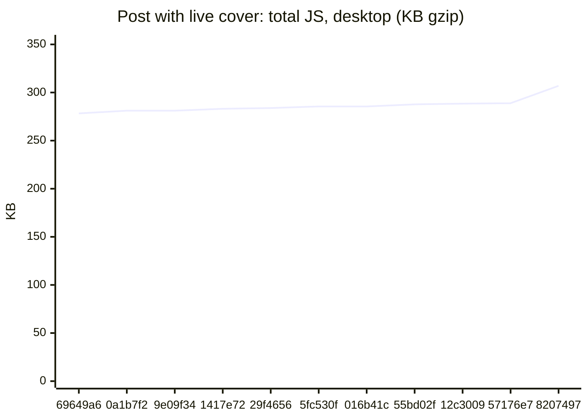
```mermaid
xychart-beta
  title "Post with live cover: total JS, desktop (KB gzip)"
  x-axis ["69649a6", "0a1b7f2", "9e09f34", "1417e72", "29f4656", "5fc530f", "016b41c", "55bd02f", "12c3009", "57176e7", "8207497"]
  y-axis "KB" 0 --> 353
  line [278.3, 281.1, 281.1, 283.1, 283.9, 285.5, 285.5, 287.7, 288.4, 288.9, 306.9]
```

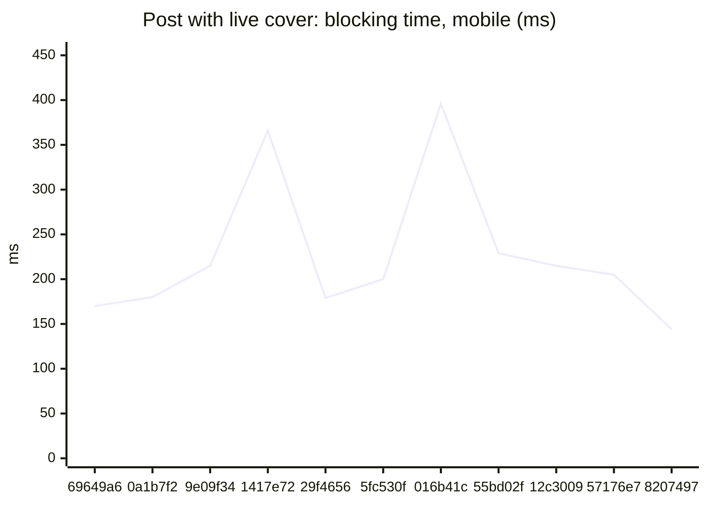
```mermaid
xychart-beta
  title "Post with live cover: blocking time, mobile (ms)"
  x-axis ["69649a6", "0a1b7f2", "9e09f34", "1417e72", "29f4656", "5fc530f", "016b41c", "55bd02f", "12c3009", "57176e7", "8207497"]
  y-axis "ms" 0 --> 456
  line [170, 180, 215, 366, 179, 200, 396, 229, 215, 205, 144]
```

### Post with diagrams

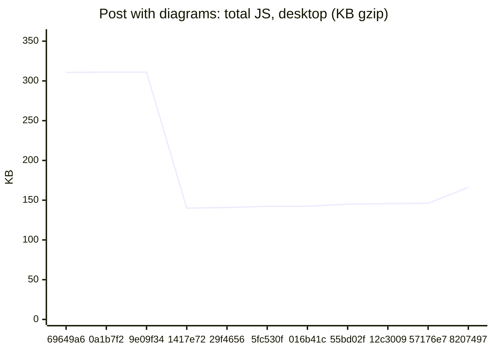
```mermaid
xychart-beta
  title "Post with diagrams: total JS, desktop (KB gzip)"
  x-axis ["69649a6", "0a1b7f2", "9e09f34", "1417e72", "29f4656", "5fc530f", "016b41c", "55bd02f", "12c3009", "57176e7", "8207497"]
  y-axis "KB" 0 --> 358
  line [310.7, 311, 311, 140, 140.8, 142.3, 142.3, 145, 145.6, 146.1, 166.2]
```

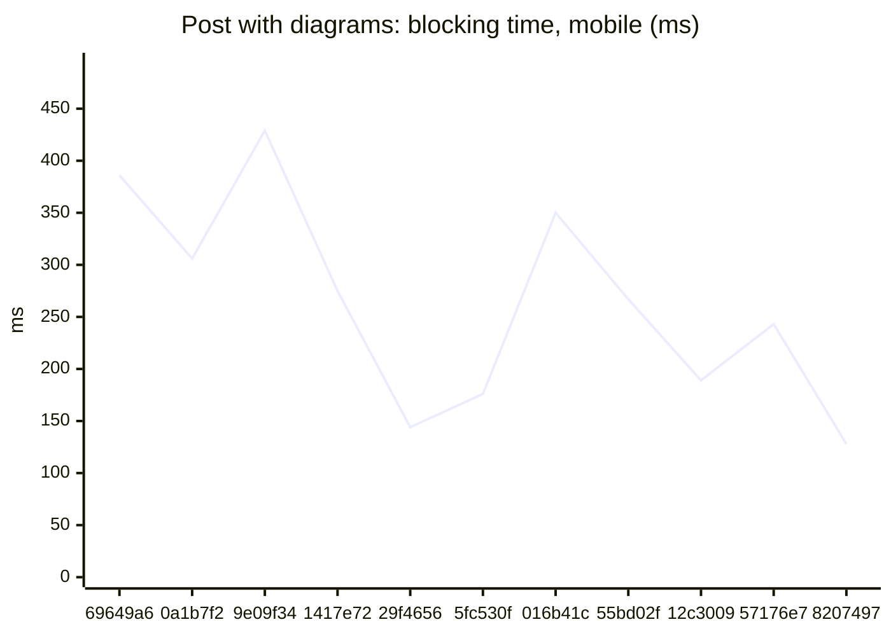
```mermaid
xychart-beta
  title "Post with diagrams: blocking time, mobile (ms)"
  x-axis ["69649a6", "0a1b7f2", "9e09f34", "1417e72", "29f4656", "5fc530f", "016b41c", "55bd02f", "12c3009", "57176e7", "8207497"]
  y-axis "ms" 0 --> 494
  line [386, 306, 429, 275, 144, 176, 350, 267, 189, 243, 128]
```

### 404

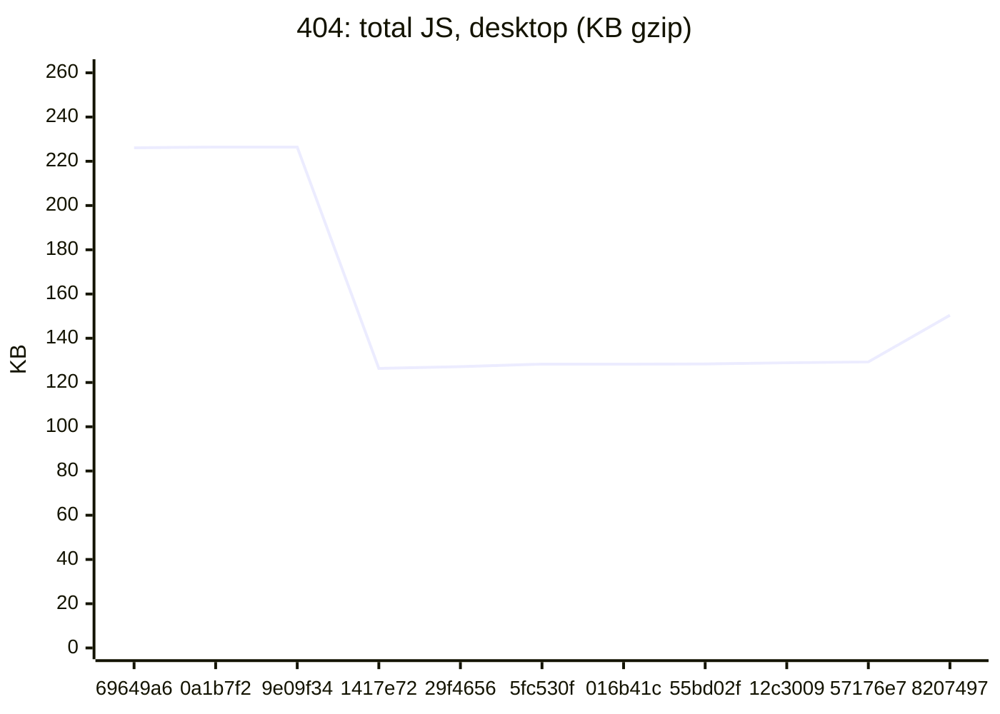
```mermaid
xychart-beta
  title "404: total JS, desktop (KB gzip)"
  x-axis ["69649a6", "0a1b7f2", "9e09f34", "1417e72", "29f4656", "5fc530f", "016b41c", "55bd02f", "12c3009", "57176e7", "8207497"]
  y-axis "KB" 0 --> 261
  line [226.1, 226.4, 226.4, 126.4, 127.2, 128.3, 128.3, 128.4, 128.9, 129.3, 150.4]
```

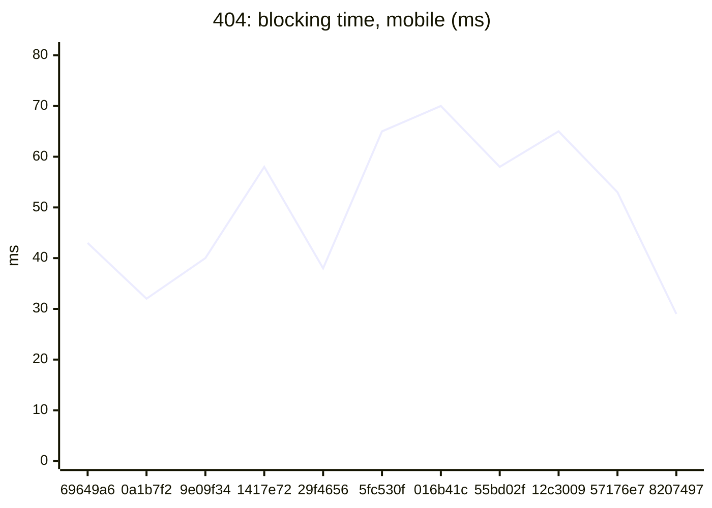
```mermaid
xychart-beta
  title "404: blocking time, mobile (ms)"
  x-axis ["69649a6", "0a1b7f2", "9e09f34", "1417e72", "29f4656", "5fc530f", "016b41c", "55bd02f", "12c3009", "57176e7", "8207497"]
  y-axis "ms" 0 --> 81
  line [43, 32, 40, 58, 38, 65, 70, 58, 65, 53, 29]
```
