# Performance history

Measured on every push to `main` by `.github/workflows/perf.yml`; this branch is written by CI only.
JS and CSS sizes are gzip. Timings are medians of 3 loads on a shared runner without a GPU, so watch their trend, not single values.

Latest: [`1417e72`](https://github.com/AxelUser/maltsev.space/commit/1417e7234b3e80d6591c60cb0fe38679e5d1526e) Feat: rework all visuals on my blog posts (#31) (2026-11-19). 4 runs recorded.

## Latest

| Page | Device | Upfront JS | Total JS | Total JS vs [`69649a6`](https://github.com/AxelUser/maltsev.space/commit/69649a642adf9e85fa19759bfed421bfd278cee2) | LCP | Blocking time |
|---|---|--:|--:|--:|--:|--:|
| Home | desktop | 123.7 KB | 124.7 KB | −0.9 KB | 188 ms | 0 ms |
| Home | mobile | 123.7 KB | 124.7 KB | −0.9 KB | 224 ms | 111 ms |
| Blog index | desktop | 119.7 KB | 122.1 KB | −0.9 KB | 176 ms | 0 ms |
| Blog index | mobile | 119.7 KB | 122.1 KB | −0.9 KB | 472 ms | 70 ms |
| About | desktop | 118.0 KB | 123.9 KB | −0.3 KB | 164 ms | 0 ms |
| About | mobile | 118.0 KB | 123.9 KB | −0.3 KB | 216 ms | 55 ms |
| Misc | desktop | 117.1 KB | 123.5 KB | −0.3 KB | 132 ms | 89 ms |
| Misc | mobile | 117.1 KB | 123.5 KB | −0.3 KB | 372 ms | 688 ms |
| Misc collection | desktop | 116.2 KB | 122.5 KB | −0.3 KB | 112 ms | 90 ms |
| Misc collection | mobile | 116.2 KB | 122.5 KB | −0.3 KB | 148 ms | 675 ms |
| Post | desktop | 124.8 KB | 127.8 KB | −0.8 KB | 208 ms | 0 ms |
| Post | mobile | 124.8 KB | 127.8 KB | −0.8 KB | 216 ms | 64 ms |
| Post with live cover | desktop | 124.8 KB | 283.1 KB | +4.8 KB | 336 ms | 534 ms |
| Post with live cover | mobile | 124.8 KB | 140.8 KB | +2.3 KB | 868 ms | 366 ms |
| Post with diagrams | desktop | 124.8 KB | 140.0 KB | −170.7 KB | 164 ms | 0 ms |
| Post with diagrams | mobile | 124.8 KB | 140.0 KB | −170.7 KB | 324 ms | 275 ms |
| 404 | desktop | 26.2 KB | 126.4 KB | −99.7 KB | 120 ms | 0 ms |
| 404 | mobile | 26.2 KB | 126.4 KB | −99.7 KB | 332 ms | 58 ms |

## Trends (last 4 runs)

### Home

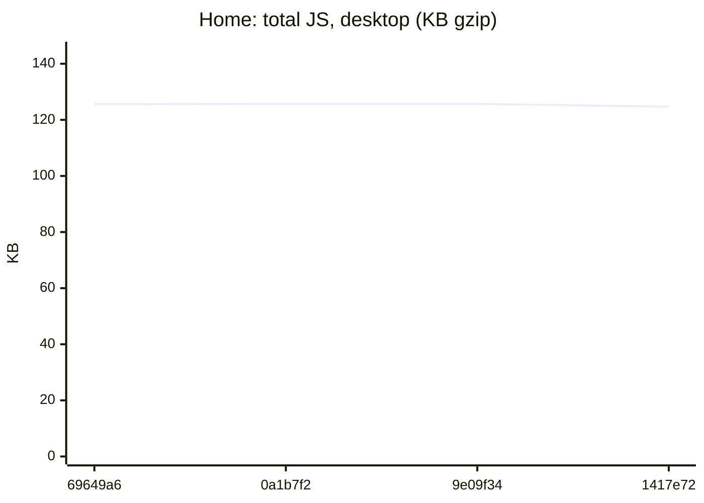
```mermaid
xychart-beta
  title "Home: total JS, desktop (KB gzip)"
  x-axis ["69649a6", "0a1b7f2", "9e09f34", "1417e72"]
  y-axis "KB" 0 --> 145
  line [125.6, 125.7, 125.7, 124.7]
```

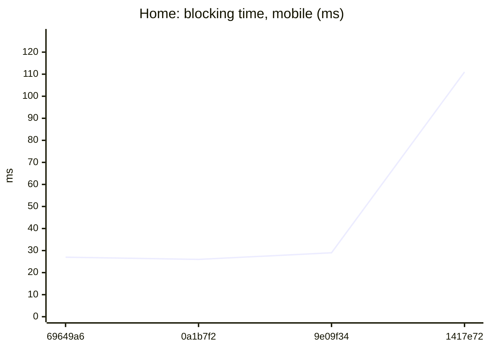
```mermaid
xychart-beta
  title "Home: blocking time, mobile (ms)"
  x-axis ["69649a6", "0a1b7f2", "9e09f34", "1417e72"]
  y-axis "ms" 0 --> 128
  line [27, 26, 29, 111]
```

### Blog index

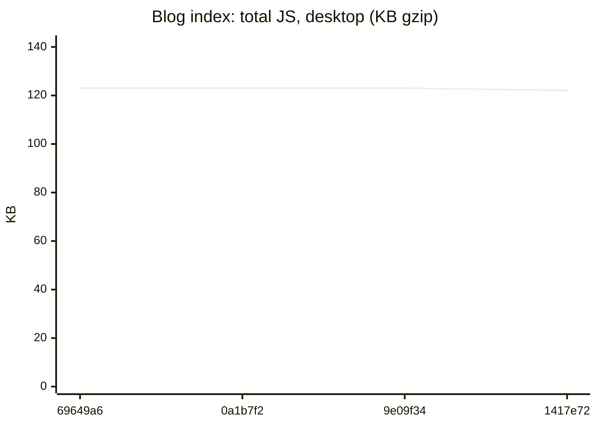
```mermaid
xychart-beta
  title "Blog index: total JS, desktop (KB gzip)"
  x-axis ["69649a6", "0a1b7f2", "9e09f34", "1417e72"]
  y-axis "KB" 0 --> 142
  line [123, 123, 123, 122.1]
```

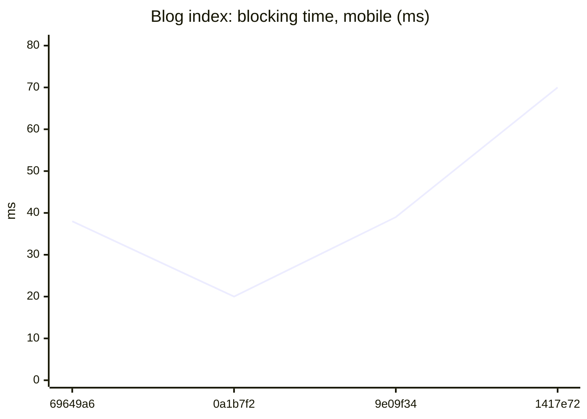
```mermaid
xychart-beta
  title "Blog index: blocking time, mobile (ms)"
  x-axis ["69649a6", "0a1b7f2", "9e09f34", "1417e72"]
  y-axis "ms" 0 --> 81
  line [38, 20, 39, 70]
```

### About

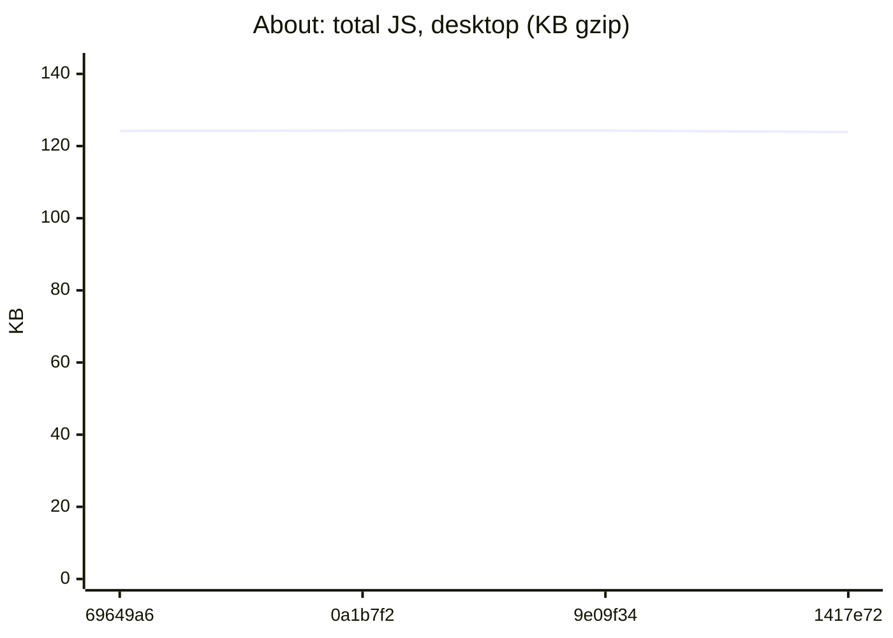
```mermaid
xychart-beta
  title "About: total JS, desktop (KB gzip)"
  x-axis ["69649a6", "0a1b7f2", "9e09f34", "1417e72"]
  y-axis "KB" 0 --> 143
  line [124.2, 124.3, 124.3, 123.9]
```

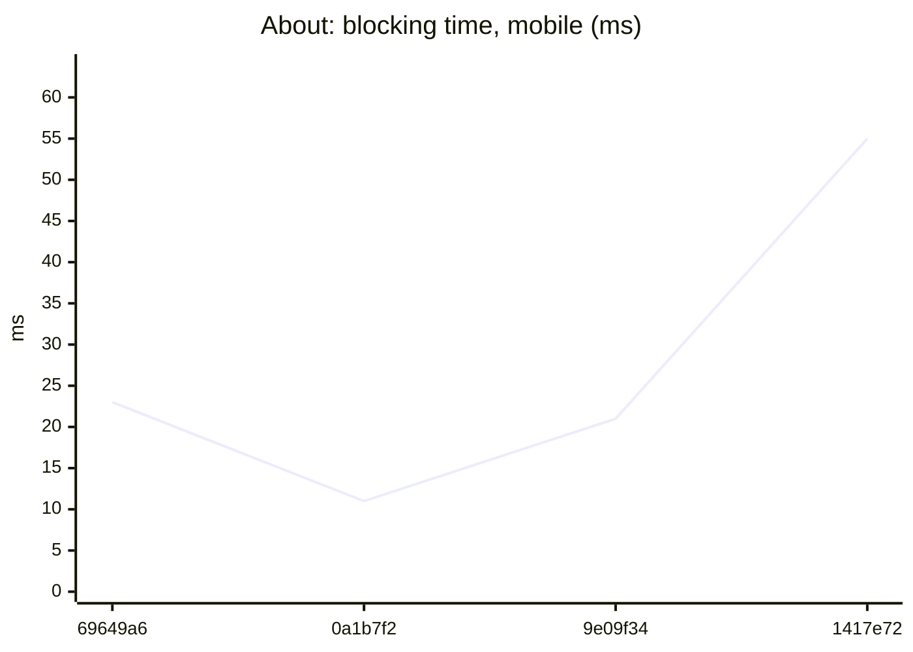
```mermaid
xychart-beta
  title "About: blocking time, mobile (ms)"
  x-axis ["69649a6", "0a1b7f2", "9e09f34", "1417e72"]
  y-axis "ms" 0 --> 64
  line [23, 11, 21, 55]
```

### Misc

```mermaid
xychart-beta
  title "Misc: total JS, desktop (KB gzip)"
  x-axis ["69649a6", "0a1b7f2", "9e09f34", "1417e72"]
  y-axis "KB" 0 --> 143
  line [123.9, 124, 123.9, 123.5]
```

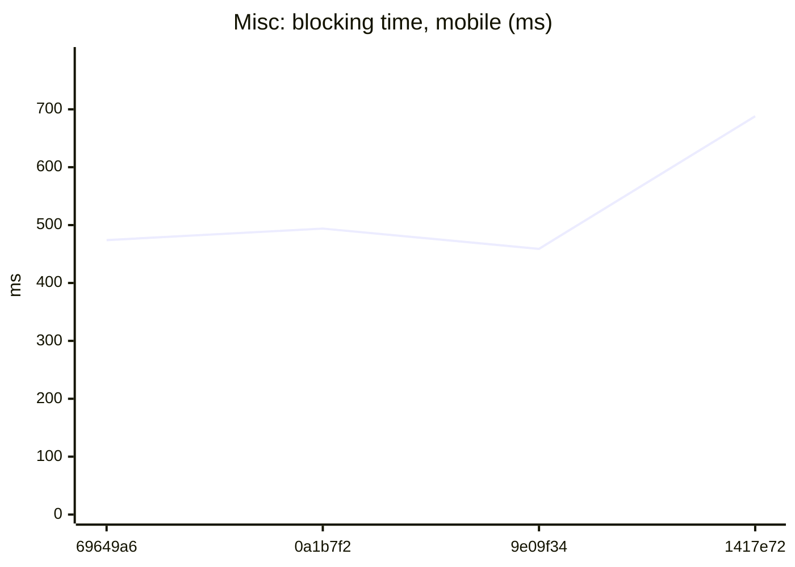
```mermaid
xychart-beta
  title "Misc: blocking time, mobile (ms)"
  x-axis ["69649a6", "0a1b7f2", "9e09f34", "1417e72"]
  y-axis "ms" 0 --> 792
  line [474, 494, 459, 688]
```

### Misc collection

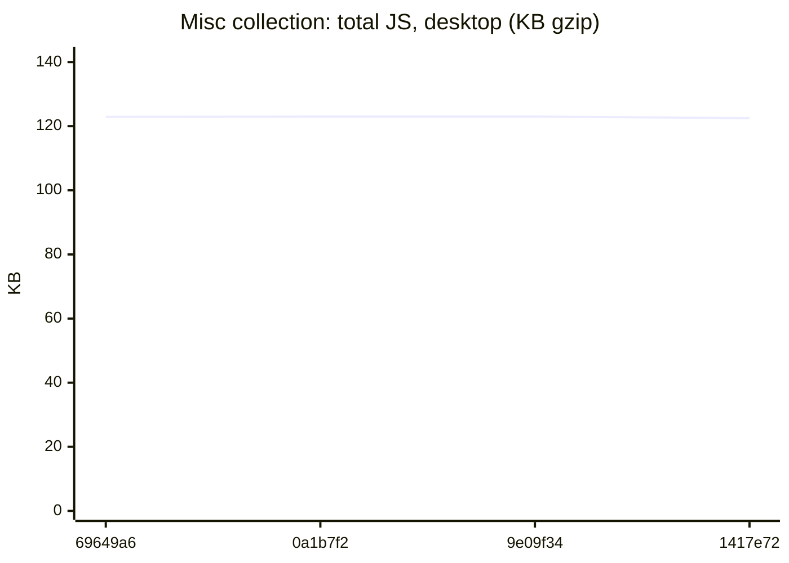
```mermaid
xychart-beta
  title "Misc collection: total JS, desktop (KB gzip)"
  x-axis ["69649a6", "0a1b7f2", "9e09f34", "1417e72"]
  y-axis "KB" 0 --> 142
  line [122.9, 123, 123, 122.5]
```

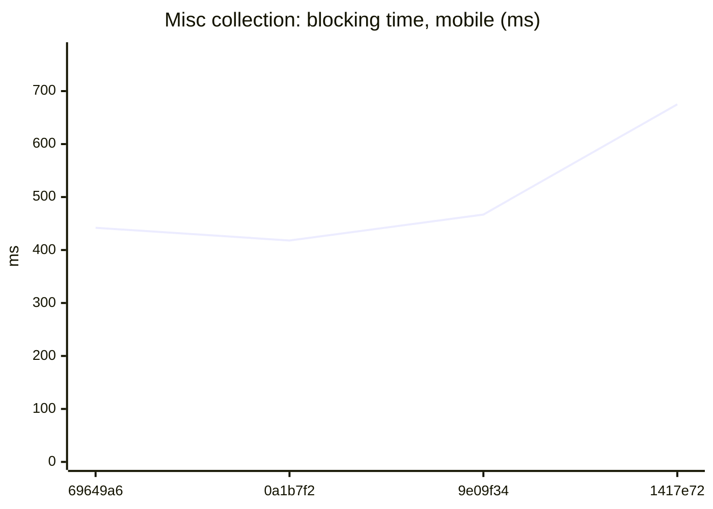
```mermaid
xychart-beta
  title "Misc collection: blocking time, mobile (ms)"
  x-axis ["69649a6", "0a1b7f2", "9e09f34", "1417e72"]
  y-axis "ms" 0 --> 777
  line [442, 418, 467, 675]
```

### Post

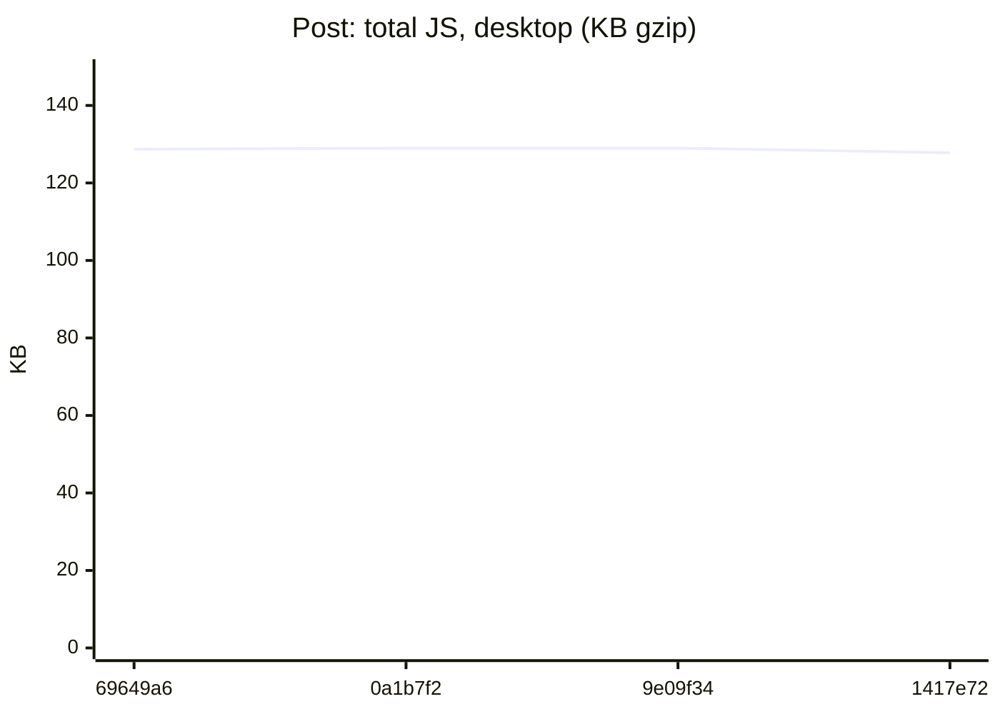
```mermaid
xychart-beta
  title "Post: total JS, desktop (KB gzip)"
  x-axis ["69649a6", "0a1b7f2", "9e09f34", "1417e72"]
  y-axis "KB" 0 --> 149
  line [128.7, 129, 129, 127.8]
```

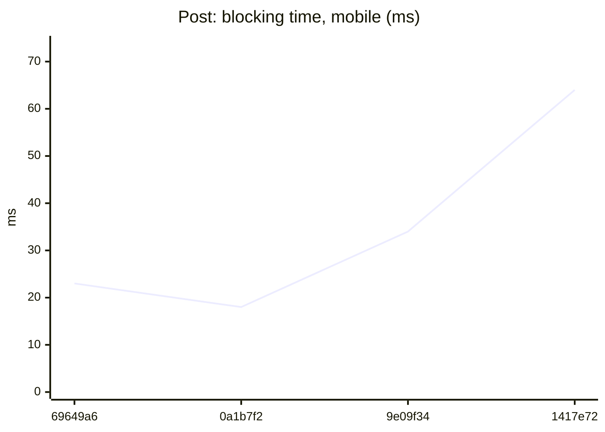
```mermaid
xychart-beta
  title "Post: blocking time, mobile (ms)"
  x-axis ["69649a6", "0a1b7f2", "9e09f34", "1417e72"]
  y-axis "ms" 0 --> 74
  line [23, 18, 34, 64]
```

### Post with live cover

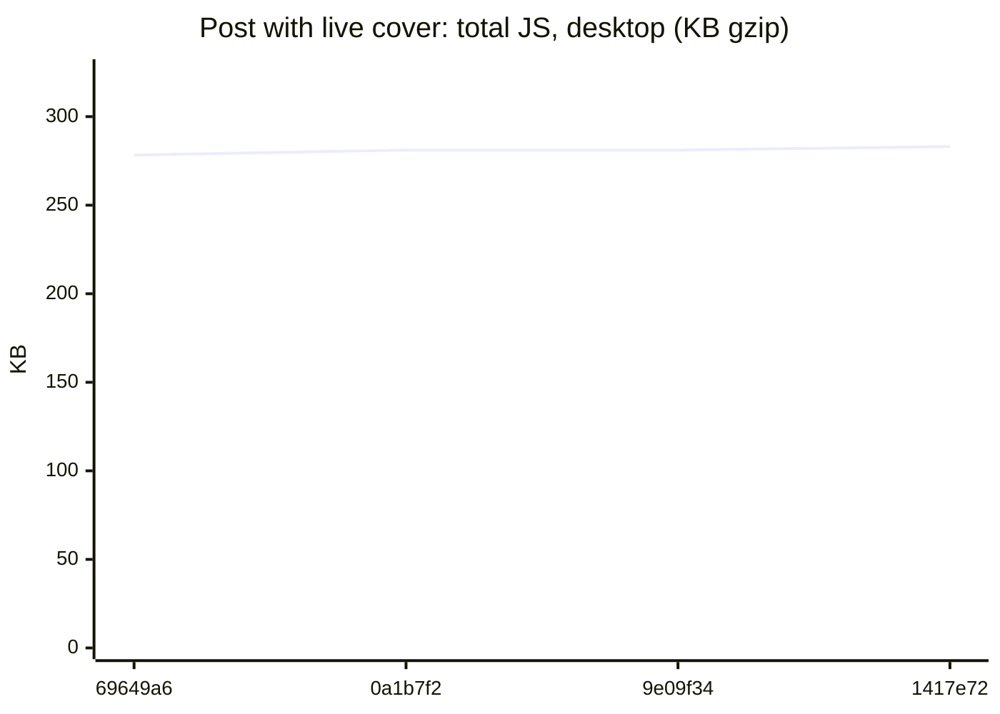
```mermaid
xychart-beta
  title "Post with live cover: total JS, desktop (KB gzip)"
  x-axis ["69649a6", "0a1b7f2", "9e09f34", "1417e72"]
  y-axis "KB" 0 --> 326
  line [278.3, 281.1, 281.1, 283.1]
```

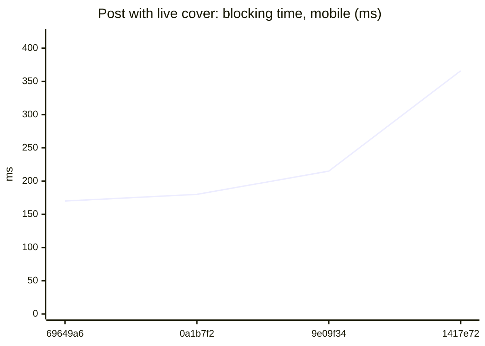
```mermaid
xychart-beta
  title "Post with live cover: blocking time, mobile (ms)"
  x-axis ["69649a6", "0a1b7f2", "9e09f34", "1417e72"]
  y-axis "ms" 0 --> 421
  line [170, 180, 215, 366]
```

### Post with diagrams

```mermaid
xychart-beta
  title "Post with diagrams: total JS, desktop (KB gzip)"
  x-axis ["69649a6", "0a1b7f2", "9e09f34", "1417e72"]
  y-axis "KB" 0 --> 358
  line [310.7, 311, 311, 140]
```

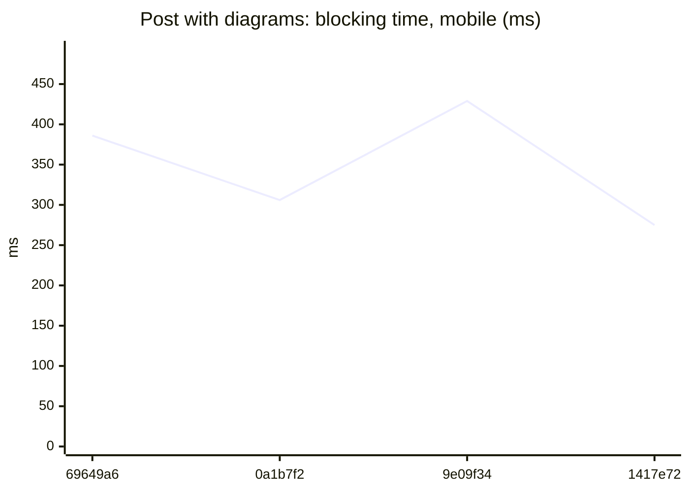
```mermaid
xychart-beta
  title "Post with diagrams: blocking time, mobile (ms)"
  x-axis ["69649a6", "0a1b7f2", "9e09f34", "1417e72"]
  y-axis "ms" 0 --> 494
  line [386, 306, 429, 275]
```

### 404

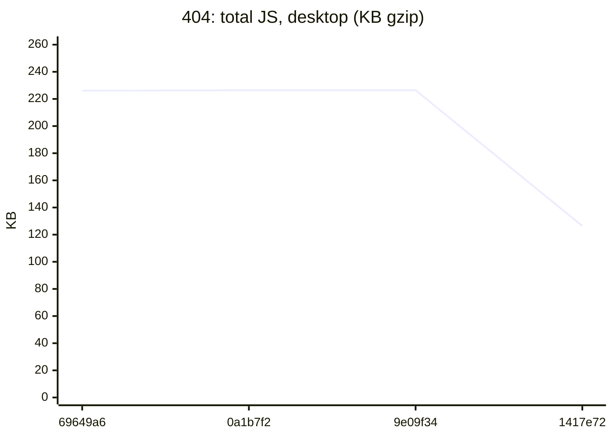
```mermaid
xychart-beta
  title "404: total JS, desktop (KB gzip)"
  x-axis ["69649a6", "0a1b7f2", "9e09f34", "1417e72"]
  y-axis "KB" 0 --> 261
  line [226.1, 226.4, 226.4, 126.4]
```

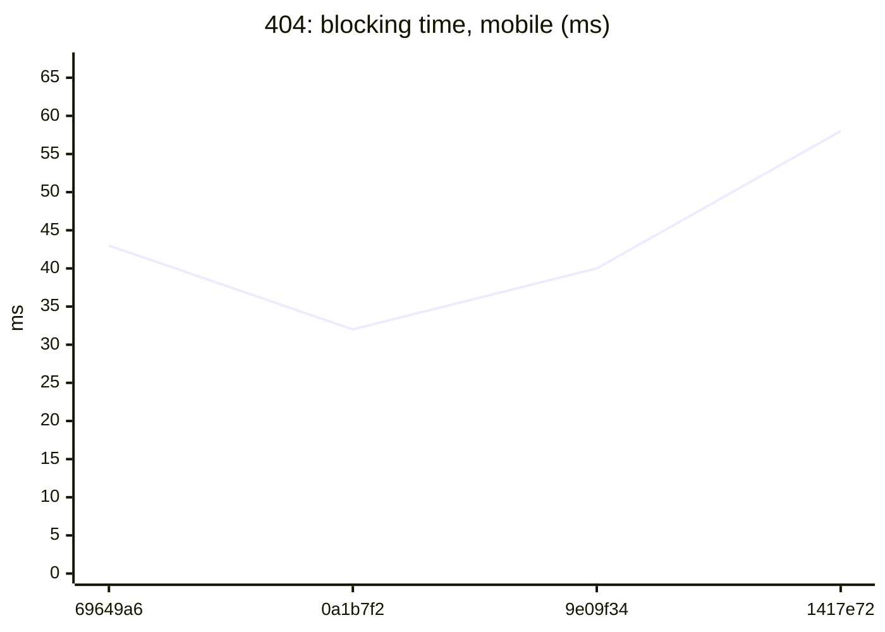
```mermaid
xychart-beta
  title "404: blocking time, mobile (ms)"
  x-axis ["69649a6", "0a1b7f2", "9e09f34", "1417e72"]
  y-axis "ms" 0 --> 67
  line [43, 32, 40, 58]
```
