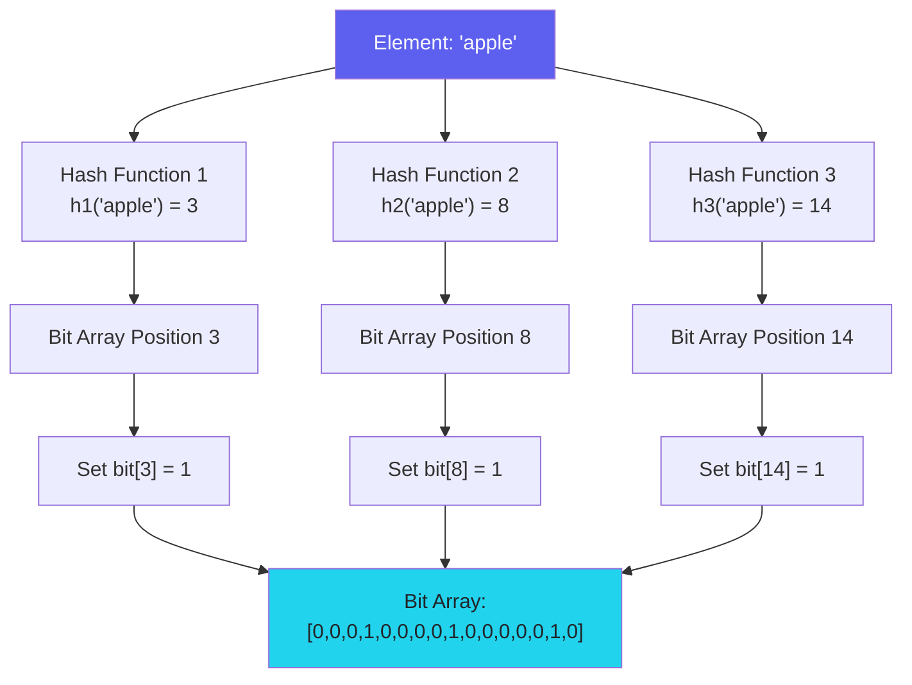
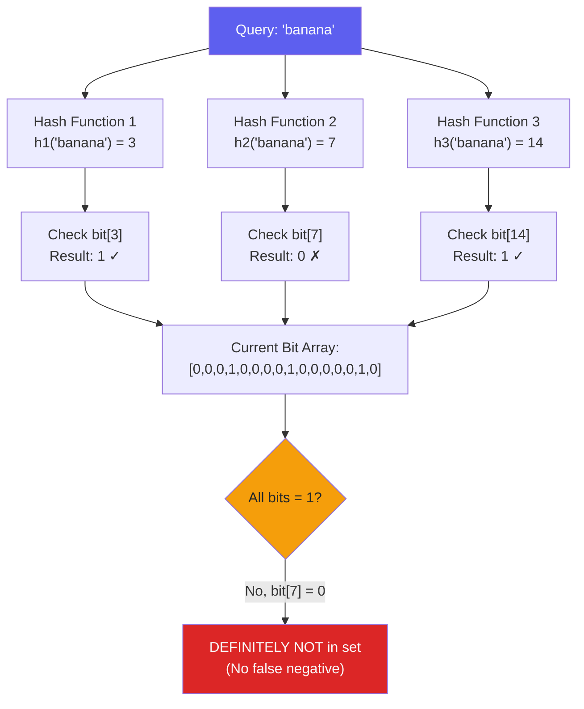
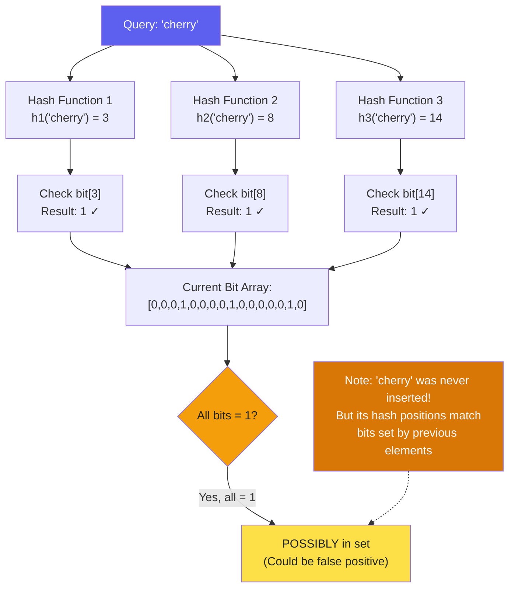
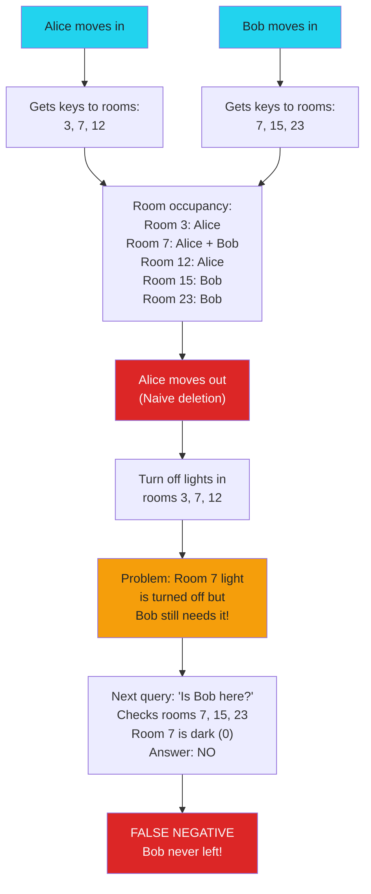
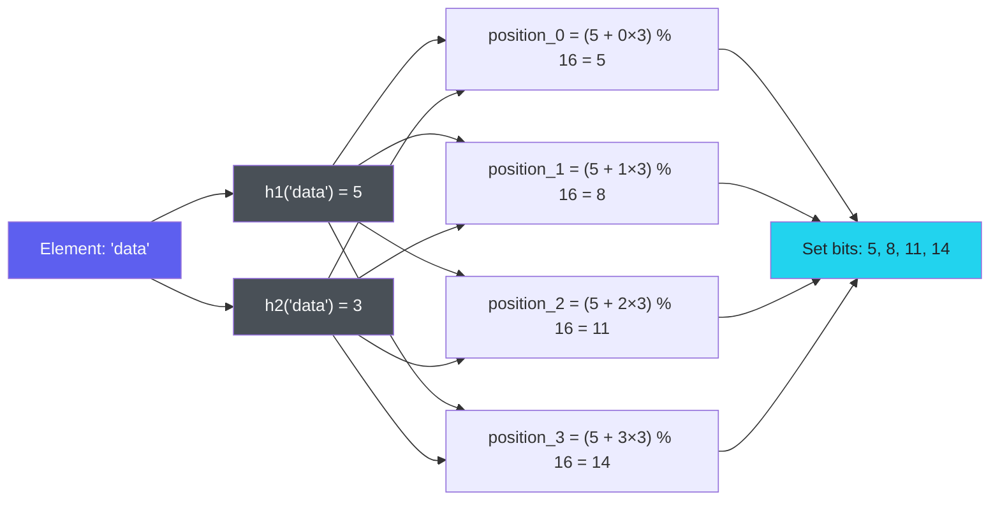

<script>
  import { SimpleBloomFilter, ParameterCalculator } from '$lib/components/visualization/bloom-filters';
</script>

There's a special category of data structures known as probabilistic data structures — and I have a soft spot for some of them. One of my absolute favorites is the Bloom filter. It's a beautifully simple concept that tackles a surprisingly common challenge: how can we quickly check whether something belongs to a set — without eating up loads of memory?

Even though Bloom filters aren't something most of us use directly in everyday business code, they quietly work behind the scenes in the infrastructure of modern distributed systems, databases, and web services.

Instead of storing the actual data, Bloom filters use a clever combo of hash functions and bit arrays to give us lightning-fast answers to a very simple question: is this thing definitely not in the set — or is it maybe there?

This post is a deep dive — it's long, and we'll take our time walking through how Bloom filters work, how they're built, and how they behave. But if you're just here to see it in action, feel free to jump straight to the [interactive playground](#live-demo) and try it out yourself. Or, if you're ready to tune your own Bloom filter, head over to the [calculator](#play-with-the-numbers) to configure parameters for your use case.

## Contents

## What is a Bloom Filter?

A Bloom filter is a space-efficient probabilistic data structure designed to test whether an element belongs to a set. The key insight behind Bloom filters is their fundamental trade-off: they can guarantee with absolute certainty that an element is _not_ in the set, but when they report that an element _is_ present, there's a small chance this may be a false positive. This asymmetry makes them especially useful as a first-line filter in systems where false positives are acceptable, but false negatives are not.

> If you're not familiar with the terms _false positive_ and _false negative_, here's a quick translation:
>
> - A **false positive** means the system says "yes, it's here" when actually it's not.
> - A **false negative** means the system says "no, it's not here" when actually it is.

The core idea is simple yet powerful. Rather than storing the actual elements, a Bloom filter keeps only hashed representations of the elements inside a compact bit array. This sacrifices some precision but delivers outstanding space efficiency and fast query times. For example, a typical Bloom filter with a 1% error rate requires just about 9.6 bits per element—regardless of the size of the elements themselves. That's a significant improvement over traditional data structures like hash tables or hash sets, which must store the full data items.

Bloom filters may report false positives — claiming an element is present when it isn't — but they never report false negatives. This makes them extremely reliable for exclusion queries. This property has made Bloom filters invaluable in a wide range of applications, from web caching to database query optimization, where the cost of a false positive is far lower than the cost of missing a true member.

## How Bloom Filters Work

The algorithm behind Bloom filters is elegantly built on three main components: a fixed-size bit array, multiple independent hash functions, and straightforward insertion and lookup operations. An empty Bloom filter starts as a bit array of `m` bits, all initialized to 0, and comes equipped with `k` different hash functions that map each element to exact `k` positions within the array. For optimal performance, these hash functions should ideally be independent and uniformly distributed.

> A hash function is a function that takes an input (like a string or number) and deterministically maps it to a number within a fixed range — in this case, some positions in the bit array.  
> When we say that hash functions should be **independent**, we mean that knowing the output of one hash function doesn't help you guess or calculate the output of another — each one works on its own, like rolling different dice.  
> And when we say they are **uniformly distributed**, we mean that they spread their results evenly across all possible positions, so no part of the resulting bit array gets overloaded with too many bits set.  
>
> Examples of commonly used hash functions include MurmurHash, xxHash, CityHash, or cryptographic ones like SHA-256 (though cryptographic hashes are usually overkill for Bloom filters).



Inserting an element is fast and deterministic: the element is fed into each of the `k` hash functions, producing `k` unique array positions. The bits at all these positions are then set to 1. No matter how many elements have already been inserted, this operation always requires exactly `k` hash calculations and `k` bit updates. The beauty of this approach is its simplicity—there's no need for collision resolution or complex data structures.

Lookup works similarly. To check whether an element might be in the set, the algorithm runs the element through the same `k` hash functions to obtain `k` positions. If any of these bits is 0, the element is definitely not in the set — this is guaranteed, since insertion would have set all these bits to 1.



However, if all the bits are 1, the element _might_ be in the set, but there's also a chance that these bits were set by previous insertions of other elements. This creates the possibility of a false positive.



The math behind this comes from the probabilistic nature of hash collisions. As more elements are added, more bits get flipped to 1, which increases the chance that any random combination of `k` positions is already occupied, even for elements that were never inserted. That's why the false positive rate grows with the number of elements, while the false negative rate stays at zero — if an element was inserted, it will always test as present.

### Live Demo

Let's get our hands dirty.

In the interactive playground below, you can **insert any string values into the Bloom filter** and watch how it modifies the internal bit array. You can also **check if a value is present**, and see how Bloom filters may return `possibly present` even for things you never inserted — that's our famous false positives in action.

A few technical notes about this demo:

- It uses a **double hashing technique** (which we'll cover in more detail later). In short: instead of generating many completely separate hashes, it combines just two distinct hash functions to simulate any number of `k` hash functions. This approach is both efficient and widely used in real-world Bloom filters.
- For simplicity and to keep things visual, the filter here uses a very compact bit array — only **16 bits** (`m = 16`) and sets `k = 4` bit positions for each element.

Here's what happens under the hood:

- When you add a value: the filter applies the double hash to calculate `k` positions and flips the corresponding bits to `1`.
- When you check a value: it verifies if all these bits are still set to `1`. If yes — it says "maybe"; if any of them is `0` — it's a definite "no".

<SimpleBloomFilter />

### Why Can't We Delete?

As you may have already noticed, we have **INSERT** and **CHECK** operations in Bloom filters, but I never mentioned a **DELETE** operation. That's because — in the original design — we simply can't. At least, not without breaking some of the guarantees that make Bloom filters useful in the first place. (Though, as we'll see later in the series, there _are_ variations of Bloom filters that support deletion.)

The root of the problem is that multiple elements may hash to the same bit positions. When you attempt to delete an element by resetting its bits back to `0`, you risk clearing bits that may still be in use by other elements. Since Bloom filters are designed to avoid **false negatives**, any operation that might accidentally remove evidence of another element's presence would break this guarantee.

As one researcher [puts it nicely:](https://www.math.umd.edu/~immortal/CMSC420/notes/bloomfilters.pdf):
> "There is no deletion basically because the only reasonable way to delete would be to hash the key and then set those corresponding bits to 0, but this could cause false negatives for other keys."

Let's visualize this. Imagine a Bloom filter as a shared apartment building where multiple tenants (elements) occupy overlapping rooms (bit positions).

- When Alice moves in, she gets keys to rooms `3`, `7`, and `12`.
- When Bob moves in, he gets keys to rooms `7`, `15`, and `23`.

Notice: both Alice and Bob share room `7`.

Now, if Alice moves out and we naively "delete" her by switching off the lights (setting bits to `0`) in rooms `3`, `7`, and `12`, we inadvertently turn off room `7`, which Bob still needs.  
The next time someone asks, "Is Bob still living here?" the system might falsely answer "No" — even though Bob never left. That's a **false negative**, and Bloom filters are designed specifically to prevent that.



Of course, for a quick and dirty workaround, an engineer might introduce a second "blacklist" Bloom filter to track deletions. When checking membership, an element would only be considered present if it's in the main filter **and** not in the deletion filter. But this comes with its own trade-offs — and we'll cover better solutions later.

### Can It Scale?

The second major limitation of standard Bloom filters is their **fixed size**. Once you create a Bloom filter, you can't resize it on the fly without breaking its mathematical guarantees.

Traditional Bloom filters require you to **declare their size upfront** — it's a bit like booking an apartment based on how many guests you _think_ might show up. This creates the classic "Goldilocks problem":

- **Underestimated capacity**: You planned for 1M elements but end up with 1.2M? The false positive rate can shoot up to 20% or even higher.
- **Overestimated capacity**: You reserved space for 10M elements but only store 1M? You're wasting 90% of your allocated memory.

The [solution](https://gsd.di.uminho.pt/members/cbm/ps/dbloom.pdf) — or rather, the workaround — is fairly straightforward: monitor the Bloom filter's saturation. Once the false positive rate crosses an unacceptable threshold, you simply add another (larger) Bloom filter. To check membership, you query all filters in sequence until you get a match or exhaust them.

## Optimizing Hash Functions

As we discussed earlier, the key to an efficient Bloom filter lies in having k independent and uniformly distributed hash functions. The more evenly they spread their outputs across the bit array, the lower the risk of false positives.

While this idea is elegant in theory, it's more complicated in practice — creating and computing many truly independent hash functions can be both conceptually challenging and computationally expensive.

Designing good hash functions isn't something most engineers do every day. Creating a brand new hash function that minimizes collisions and evenly spreads values across the bit array is far from trivial. And Bloom filters typically require at least two hash functions — sometimes even four or more depending on your workload and the nature of the data you're adding.

As you probably noticed in your day-to-day work, we rarely write our own math-heavy algorithms from scratch. Instead, we lean on solid, battle-tested abstractions: hashing libraries, built-in data structures, utility modules, etc. Even if you're adventurous enough to roll out your own Bloom filter implementation, you probably don't want to spend weeks designing hash functions from scratch — but you still want decent performance.

On top of that, hash computation itself can get expensive, especially if you're using cryptographic hashes like SHA-256. These functions are overkill for Bloom filters and introduce unnecessary overhead. Faster non-cryptographic hash functions like **MurmurHash** or **xxHash** are much better suited for this use case — but even then, if you naively calculate _k_ separate hashes per element, the cost adds up.

Let's take a look at a simple, naive approach just to set the baseline:

```kotlin
val h1 = hash_function_1(data)
val h2 = hash_function_2(data)
...
val hk = hash_function_k(data)
```

At first glance, problem solved: you're generating multiple hash values by salting your input with different constants. It works, and it's easy to implement. But this method has an important drawback — you need to compute _k_ separate hashes for every element, which becomes costly for larger _k_ values (say 10 or more) — especially if the hash function itself isn't cheap.

While this approach might be acceptable for use-cases where performance isn't important, let's be honest: for such cases, you probably don't even need a Bloom filter — a plain old `Set` would do the job just fine.

### Double Hashing Approach

Luckily, there's a well-known trick to avoid computing _k_ independent hash functions while still achieving almost the same statistical behavior. This method is often called **double hashing** or **Kirsch-Mitzenmacher optimization**, after the authors who [formally analyzed it](https://www.eecs.harvard.edu/~michaelm/postscripts/rsa2008.pdf).

The idea is surprisingly simple: instead of calculating _k_ totally independent hashes, you calculate just two independent hash functions, and then combine them to generate the rest.

The formula goes like this:

$$
\text{position}_i(x) = (h_1(x) + i \cdot h_2(x)) \bmod m
$$

Where:

- `h1(x)` and `h2(x)` are two independent hash functions (or at least two reasonably uncorrelated ones).
- `i` is the index of the hash function you want (ranging from 0 to k-1).
- Each resulting value is then typically reduced by modulo `m` (the bit array size) to map it into the bit array in case it's larger than the bit array size.

In code, it may look something like this:

```kotlin
val h1 = hash1(data)
val h2 = hash2(data)
for (i in 0 until k) {
    val position = (h1 + i * h2) % m
    setBit(position)
}

```

This approach has several nice properties:

- You only calculate **two** hash functions per inserted element, no matter how many hash functions _k_ you want.
- You get a whole sequence of hash values that are nicely spread across your bit array.
- The results are nearly as good as having fully independent hashes, at least for practical Bloom filter usage.



#### Why does Double-Hashing Work?

Without diving too deep into math: Kirsch and Mitzenmacher showed that this sequence of hashes behaves _almost_ like having _k_ independent hashes for the purposes of a Bloom filter. The false-positive rate remains essentially the same, while computational cost is dramatically reduced.

This optimization is commonly used in real-world Bloom filter implementations — for example, it's part of [Cassandra's BloomFilter implementation](https://github.com/apache/cassandra/blob/trunk/src/java/org/apache/cassandra/utils/BloomFilter.java).

#### But what if `h2` is zero?

Yeah... You may have already noticed a potential issue in our formula:

$$
\text{position}_i(x) = (h_1(x) + i \cdot h_2(x)) \bmod m
$$

If `h2(x)` happens to be zero, all your hashes collapse into the same value:

$$
\text{position}_i(x) = (h_1(x) + i \cdot 0) \bmod m = h_1(x) \bmod m
$$

How likely is that? Well, it depends, but not impossible.

To protect yourself, many implementations include a tiny fix like:

```kotlin
if (h2 == 0) {
    h2 = 1
}
```

This guarantees forward progress: even in the worst case you still generate `k` distinct bit positions.

#### `h2(x)` and `m` Should Be Coprime

There's one more sneaky issue that's often overlooked when using the double hashing formula:

$$
\text{position}_i(x) = (h_1(x) + i \cdot h_2(x)) \bmod m
$$

Everything seems fine... until one day your Bloom filter quietly becomes _less random than you expect_. This happens when `h2(x)` and `m` (the Bloom filter size) are not **coprime**.

>**What does "coprime" mean?**
>Two numbers are coprime if they don't share any common divisors except 1.
>For example:
>
>- `9` and `16` are coprime.
>- `6` and `18` are **not** coprime (since they share divisor `6`).

If `h2(x)` and `m` share a common divisor, the sequence of hashes generated

```
h1(x), h1(x) + h2(x), h1(x) + 2*h2(x), ...
```

will only cover part of the bit array. In other words: **you won't reach all possible bit positions**.

This leads to: fewer unique bits set → more collisions → higher false-positive rates → sad stakeholders.

Let's say you have:

- `m = 10`
- `h1(x) = 2`
- `h2(x) = 4` (notice that both `4` and `10` share divisor `2`)

Now calculate the hashes:

```
(2 + 0*4) % 10 → 2  
(2 + 1*4) % 10 → 6  
(2 + 2*4) % 10 → 0  
(2 + 3*4) % 10 → 4  
(2 + 4*4) % 10 → 8  
(2 + 5*4) % 10 → 2  (cycle repeats)
```

You never touch bit positions `1, 3, 5, 7, 9` — half of your bit array is completely unused!

Ideally, choose `m` to be a **prime number** — then any `h2(x)` is automatically coprime with `m` (except if `h2(x) = 0` which we already handled earlier).

Or, when `m` is not prime, ensure that your hash function produces `h2(x)` values that are statistically unlikely to share factors with `m`. A simple safety net is to force `h2(x)` to always be odd:

```kotlin
if (h2 % 2 == 0) {
    h2 += 1
}
```

This avoids most practical problems if `m` is a power of two (which is very common for bit arrays).

Let's walk through a small example where things work exactly as intended:

- `m = 10`
- `h1(x) = 2`
- `h2(x) = 7` (notice that `7` and `10` are coprime (they share no divisors except `1`)

Hash values be like that:

```
(2 + 0*7) % 10 → 2  
(2 + 1*7) % 10 → 9  
(2 + 2*7) % 10 → 6  
(2 + 3*7) % 10 → 3  
(2 + 4*7) % 10 → 0  
(2 + 5*7) % 10 → 7  
(2 + 6*7) % 10 → 4  
(2 + 7*7) % 10 → 1  
(2 + 8*7) % 10 → 8  
(2 + 9*7) % 10 → 5
```

Full cycle, no repeats — the bit array is fully covered.

### Wide Hash Split

There's another technique that sometimes gets used, especially in high-performance Bloom filters - wide hash split. A good example is [Google Guava](https://github.com/google/guava/blob/master/guava/src/com/google/common/hash/BloomFilterStrategies.java), where it works nicely alongside the double hashing approach.

The core idea is also simple - instead of generating multiple completely separate hash values, you generate **one wide hash output** (e.g. 128 or 256 bits), and then split it into multiple pieces to simulate multiple hash functions.

```kotlin
val wideHash = hash128(data)

val h1 = (wideHash shr 0)  % m // or apply mask, if m is a power of two
val h2 = (wideHash shr 16) % m
val h3 = (wideHash shr 32) % m
val h4 = (wideHash shr 48) % m
```

#### Why does hash split work?

Good hash functions like **MurmurHash3 128-bit**, **CityHash128**, or **xxHash3 128-bit** are designed to spread randomness across all bits, i.e. have avalanche effect, when small input changes drastically alter all output bits. So, the upper bits are just as random as the lower bits.

Of course, like everything in Bloom filters — no free lunch:

- The resulting hashes are **not truly independent**, just decorrelated, i.e. different enough. This may theoretically increase false positives slightly if your input data is highly correlated and the hash function doesn't have good avalanche effect.
- You're limited by how many slices you can get — e.g., 128-bit hash gives you at most 4×32-bit slices (or more if you slice into smaller chunks).

### Recap

| Method                    | # of Hash Calls | Speed       | Independence       |
| ------------------------- | --------------- | ----------- | ------------------ |
| k hashes                  | k               | Slow        | True               |
| Double hashing            | 2               | Fast        | Almost             |
| Wide hash split           | 1               | Even faster | Almost             |

## How to Calculate Parameters

Strictly speaking, this section should be at the very beginning — but I didn't want to scare you away with formulas too early. Since you're still here, let's finally dive into how to properly configure your Bloom filter.

Some of the parameters you've already met, but let's quickly recap:

1. **m** — the size of the bit array (in bits)
2. **n** — the expected number of inserted elements
3. **k** — the number of hash functions and bit positions to set
4. **p** — the false positive probability (also called **FPP**)

These parameters are tightly interconnected — changing one affects the others, leading to trade-offs between memory usage, query speed, and accuracy.

### The False Positive Rate

The false positive rate is arguably the most important characteristic of a Bloom filter. It represents the probability that the filter incorrectly reports an element as present when it actually isn't. The theoretical false positive probability can be approximated by:

$$
p = \left(1 - e^{-kn/m}\right)^k
$$

Where once again:

- `p` is the false positive probability
- `k` is the number of hash functions and bit positions to set
- `n` is the number of inserted elements
- `m` is the size of the bit array

>It's worth noting that this formula is an approximation. According to [detailed mathematical analysis](https://cglab.ca/~morin/publications/ds/bloom-submitted.pdf), the actual false positive rate is strictly larger than this approximation for any k ≥ 2.

### How Parameters Affect Performance

#### Memory Usage

The memory usage of a Bloom filter is directly proportional to `m`. This is one of its key strengths — excellent space efficiency compared to hash tables or sets.

For [example](https://valkey.io/blog/introducing-bloom-filters/), let's say you want to maintain 500 Bloom filters, each capable of holding 5 million elements. The total memory depends heavily on your target false positive rate:

|False Positive Rate|Total Memory|Memory Savings vs SET|
|---|---|---|
|0.01 (1 in 100)|2.9 GB|98.08% saved|
|0.001 (1 in 1,000)|4.9 GB|96.80% saved|
|0.00001 (1 in 100,000)|7.8 GB|94.88% saved|

#### Query Performance

Both insertions and lookups require computing `k` hash functions and updating or reading `k` bits. Therefore, both operations have time complexity `O(k)`, assuming that hash function is some constant time operation. Since `k` is typically small (usually between 5 and 12), Bloom filters are extremely fast for membership checks, regardless of how many elements they contain.

### Calculating Optimal Parameters

#### Optimal Size (m)

If you know the expected number of elements (`n`) and your target false positive probability (`p`), you can compute the optimal size of the bit array as:

$$
m = -\frac{n \ln(p)}{(\ln(2))^2}
$$

Or approximately:

$$
m \approx -n \ln(p) \cdot 2.08
$$

#### Optimal Number of Hash Functions (k)

Once you have `m`, you can compute the optimal number of hash functions:

$$
k = \frac{m}{n} \ln(2)
$$

Or approximately:

$$
k \approx \frac{m}{n} \cdot 0.693
$$

Choosing this optimal `k` minimizes the false positive rate for your selected `m` and `n`.

### Examples With Calculations

#### Example 1: Calculating Size and Hash Functions

Given:

- `n = 100,000` (expected elements)
- `p = 0.01` (1% false positive rate)

Calculate `m`:

```
m = -(n * ln(p)) / (ln(2))^2
  = -(100,000 * ln(0.01)) / (ln(2))^2
  = -(100,000 * (-4.6052)) / (0.4809)
  ≈ 958,506 bits (≈ 117 KiB)
```

Calculate `k`:

```
k = (m / n) * ln(2)
  = (958,506 / 100,000) * 0.693
  ≈ 6.64 (≈ 7 hash functions)
```

#### Example 2: Calculating False Positive Rate

Given:

- `n = 100` (elements)
- `m = 1,000` (bits)
- `k = 4` (hash functions)

Calculate `p`:

```
p = (1 - e^(-k * n / m))^k
  = (1 - e^(-4 * 100 / 1000))^4
  = (1 - e^(-0.4))^4
  = (1 - 0.6703)^4
  = (0.3297)^4
  ≈ 0.0118
```

So the false positive rate is approximately **1.18%**.

### Play With The Numbers

If you're getting bored (or dizzy) with all these formulas — don't worry. Instead of torturing your brain, let's just throw your numbers into the calculator below and let it crunch everything for you.

After all, you're sitting right next to one of the most advanced calculators humanity ever built — **for Christ's sake, let it do the math.**

<ParameterCalculator />

## Wrapping Up

Every time I revisit Bloom filters, I'm reminded why computer science so often feels like magic. A simple structure — just a bit array and a handful of hash functions — yet it dances gracefully with probability to solve problems that could easily swallow gigabytes of memory if approached naively.

And yet — this is only the beginning.

As we move forward, we'll see how this beautifully simple idea can be stretched, twisted, and extended to take on even bigger challenges.

See you in the next parts — things are about to get even more interesting.
