Bloom filters are incredibly space-efficient probabilistic data structures, perfect for answering a simple question: "Is this element in the set — no or maybe?"

But as we discussed in [deep dive into Bloom filters](/blog/008-bloom-filters-pt1), there's a big limitation: **they don't support deletion**.

In this part of the series, we'll tackle that problem. We'll explore how we can extend Bloom filters to allow element removal — and what trade-offs come with that.

```svgbob
      Standard Bloom Filter vs Counting Bloom Filter
      
  Standard BF (bit array):
  +---+---+---+---+---+---+---+---+---+---+
  | 0 | 1 | 0 | 1 | 1 | 0 | 1 | 0 | 1 | 0 |
  +---+---+---+---+---+---+---+---+---+---+
    0   1   2   3   4   5   6   7   8   9

  Counting BF (counter array):  
  +---+---+---+---+---+---+---+---+---+---+
  | 0 | 2 | 0 | 1 | 3 | 0 | 1 | 0 | 2 | 0 |
  +---+---+---+---+---+---+---+---+---+---+
    0   1   2   3   4   5   6   7   8   9
    
  Each counter tracks how many elements 
  have set that position
```

## Contents

## Why Deletion Is Hard

To understand why deletion doesn't work in a classic Bloom filter, let's quickly revisit how it operates.

A Bloom filter consists of two core components:

- A fixed-size **bit array**
- A set of **hash functions**

Each time you insert an element, it is hashed `k` times to determine `k` bit positions in the array. Those bits are then set to `1`. However, since the bit array is shared across all elements, multiple elements may overlap and set the same bits.

This is expected — and it's what makes Bloom filters space-efficient. But it also leads to a key limitation: **you can't tell which element set a given bit**.

If you try to delete an element by resetting its `k` bits to `0`, you may accidentally unset bits that are still needed by other elements. This would break one of the Bloom filter's key guarantees: **no false negatives**. After such a deletion, a previously inserted element might no longer be recognized as present.

> It's similar to erasing your tag from a public graffiti wall — you might end up scrubbing off someone else's mark too, and now no one can tell they were ever there.

### Step 1: Inserting Elements


### Step 2: Attempting Deletion (The Problem)

```mermaid
graph TD
    A["Current state:<br/>[0,0,1,0,0,1,0,1,1,0,1]<br/>Both A and B inserted"] --> B["❌ Attempt to delete Element A<br/>Reset positions: 2, 5, 8"]
    
    B --> C["Naive deletion:<br/>bit[2] = 0<br/>bit[5] = 0 ⚠️ (shared with B!)<br/>bit[8] = 0"]
    
    C --> D["Corrupted bit array:<br/>[0,0,0,0,0,0,0,1,0,0,1]<br/>Only positions 7, 10 remain set"]
    
    style A fill:#495057,color:#f8f9fa
    style B fill:#dc2626,color:#f8f9fa
    style C fill:#f59e0b,color:#212529
    style D fill:#dc2626,color:#f8f9fa
```



### Step 3: The False Negative

```mermaid
graph TD
    A["Corrupted state:<br/>[0,0,0,0,0,0,0,1,0,0,1]<br/>Element A 'deleted'"] --> B["💥 Check Element B<br/>Hash positions: 5, 7, 10"]
    
    B --> C["Check each position:<br/>bit[5] = 0 ❌<br/>bit[7] = 1 ✓<br/>bit[10] = 1 ✓"]
    
    C --> D{"All bits set?"}
    
    D -->|"No, bit[5] = 0"| E["FALSE NEGATIVE!<br/>Element B appears absent<br/>but was never deleted"]
    
    style A fill:#dc2626,color:#f8f9fa
    style B fill:#f59e0b,color:#212529
    style D fill:#f59e0b,color:#212529
    style E fill:#dc2626,color:#f8f9fa
```



This is why deletion is fundamentally unsafe in standard Bloom filters.

## Easy Workarounds (That Actually Don't Work)

Before diving into data structure modifications, let's look at a few simple workarounds for deletion.

### Rebuilding the Filter

In many use cases, full deletion support isn't necessary. Instead, you can periodically **rebuild** the Bloom filter from scratch — daily, weekly, or based on certain metrics like false positive rate. This works especially well if:

- You can tolerate brief downtime or rebuild in the background.
- The data set is relatively stable or changes in batches.

This is often the simplest and safest approach.

### Using a Tombstone Filter

Another workaround is to maintain a second Bloom filter — a **tombstone filter** — to track deletions. When you remove an element, you insert it into the tombstone filter.

To check for membership:

1. Check the main Bloom filter.
2. If it's a **possible match**, check the tombstone filter.
3. If it also matches there, treat it as deleted.

The problem? If the tombstone filter gives a **false positive**, you'll wrongly conclude that an element was deleted — effectively creating a **false negative**. This defeats the main strength of Bloom filters.

So while this method technically adds delete support, it weakens the guarantees and is rarely worth the risk.

## Counting Bloom Filters

The core strength of Bloom filters lies in their simplicity: a bit array and some hash functions. This makes them fast and compact — but also limited. In particular, the bit array can't tell **which elements** contributed to setting each bit.

That's where **Counting Bloom Filters (CBFs)** come in.

Originally proposed by [Fan et al.](http://staff.ustc.edu.cn/~xiangyangli/paper/Journal/False-Negative-Bloom-TKDE.pdf), CBFs replace the bit array with an array of **small integer counters** — typically 4-bit values. These allow us to track how many elements have set each position.

### How It Works

- **Insertion**: Hash the element to `k` positions, and increment the counters at those positions.
- **Membership check**: Just like in a standard Bloom filter — all counters must be non-zero.
- **Deletion**: Hash the element again, and decrement those same counters.

As long as each counter accurately reflects how many elements touched a position, we can safely remove individual elements without affecting others.

Let's see this in action:

```svgbob
              Counting Bloom Filter Memory Layout
              
    Counter Array (4-bit counters, 0-15 range):
    +-----+-----+-----+-----+-----+-----+-----+-----+-----+-----+
    |  0  |  1  |  0  |  0  |  2  |  0  |  1  |  1  |  0  |  1  |
    +-----+-----+-----+-----+-----+-----+-----+-----+-----+-----+
      0     1     2     3     4     5     6     7     8     9

    Element A: hash(A) → positions [1, 4, 7]
               increment counters[1], [4], [7]
               
    Element B: hash(B) → positions [4, 6, 9]  
               increment counters[4], [6], [9]
               
    Position 4 is shared: counter = 2 (both A and B)
    
    Memory usage: array_size × 4 bits per counter
```

#### Step 1: Inserting Elements to the CBF


#### Step 2: Safe Deletion

```mermaid
graph TD
    A["Current state:<br/>[0,1,0,0,2,0,1,1,0,1]<br/>Both A and B inserted"] --> B["✅ Delete Element A<br/>Hash positions: 1, 4, 7"]
    
    B --> C["Decrement counters:<br/>counter[1] = 0<br/>counter[4] = 1 (2→1, still > 0)<br/>counter[7] = 0"]
    
    C --> D["Updated counter array:<br/>[0,0,0,0,1,0,1,0,0,1]<br/>Element B's data preserved!"]
    
    style A fill:#495057,color:#f8f9fa
    style B fill:#22c55e,color:#212529
    style C fill:#22c55e,color:#212529
    style D fill:#22c55e,color:#212529
```



#### Step 3: Successful Check

```mermaid
graph TD
    A["Updated state:<br/>[0,0,0,0,1,0,1,0,0,1]<br/>Element A deleted safely"] --> B["✅ Check Element B<br/>Hash positions: 4, 6, 9"]
    
    B --> C["Check each counter:<br/>counter[4] = 1 ✓<br/>counter[6] = 1 ✓<br/>counter[9] = 1 ✓"]
    
    C --> D{"All counters > 0?"}
    
    D -->|"Yes, all > 0"| E["SUCCESS!<br/>Element B still present<br/>No false negative"]
    
    style A fill:#22c55e,color:#212529
    style B fill:#22c55e,color:#212529
    style C fill:#22c55e,color:#212529
    style D fill:#22c55e,color:#212529
    style E fill:#22c55e,color:#212529
```



This small change enables **insert**, **check**, and **delete** operations — all while preserving the basic Bloom filter structure.

### Handling Counter Overflow and Underflow

When implementing a CBF, you need to be mindful of counter limits. Most implementations use 4-bit counters, which means each counter can represent values from 0 to 15.

#### Overflow During Insertion

If a counter is already at its maximum value (e.g., 15) and you try to increment it, the result will either:

- Wrap around to 0 (in case of overflow), or
- Overwrite memory incorrectly (if not handled properly)

To prevent this, insertions should **skip incrementing** counters that are already at their maximum value.

#### Underflow During Deletion

Similarly, if a counter is at `0` and you try to decrement it, you risk corrupting the filter — especially if that position was never associated with the element being removed. Deletion code should **never decrement** a zero counter.

This raises a deeper issue: if the counter is `0`, the element likely wasn't inserted — and deleting it can silently damage the filter. That brings us to a more subtle and dangerous scenario...

### Removing a Non-Existent Element

Counting Bloom Filters only work reliably if deletions are performed on elements that were actually inserted. If you delete an element that was never added, you can unintentionally corrupt the state of the filter.

Let's walk through a simple example:

- Element **A** hashes to positions `1, 5, 7, 9`
- Element **B** hashes to positions `1, 3, 7, 8`

Now suppose you insert **A** — this increments the counters at positions `1, 5, 7, 9`.

Then, without inserting **B**, you try to delete it. This decrements counters at `1, 3, 7, 8`.

Here's what goes wrong:

- Counters at positions `1` and `7` (shared with A) are decremented — possibly to zero.
- When you later check for **A**, it may appear absent, even though it was never deleted.
- Counters at positions `5` and `9` remain set — creating an inconsistent state.

This creates a **false negative**, something Bloom filters are explicitly designed to avoid. And the worst part? There's no way to detect this corruption after the fact.

### Is It Worth It?

Counting Bloom Filters provide a straightforward way to support deletions: just replace bits with small counters. The core algorithm remains nearly identical to the classic Bloom filter — simple and efficient.

But this simplicity comes at a cost:

- Requires more memory — typically 4× larger due to 4-bit counters.
- Vulnerable to accidental false negatives if deletions aren't handled carefully.
- Doesn't track which elements contributed to a counter — so overlapping deletions are still a risk.

CBFs were proposed back in 2000 as a practical workaround, and they still hold up in simple scenarios. But if memory is tight or deletion accuracy is critical, modern alternatives like **Cuckoo Filters** offer better guarantees.

Before we get there, let's look at one more variation that builds on this concept — the **d-left Counting Bloom Filter**.

## d-left Counting Bloom Filter

This data structure is quite different from classic Bloom and Counting Bloom Filters, but it gives us useful ideas that eventually lead to Cuckoo Filters — especially I love the point when it comes to handling collisions.

### Core Idea

The [d-left Counting Bloom Filter (dlCBF)](https://people.eecs.berkeley.edu/~sylvia/cs268-2014/papers/countingbloom.pdf) replaces the flat array of counters with a multi-part structure — or simply, `d` separate hash tables (segments).

Each segment contains `B` buckets. Every bucket holds a small, fixed number of cells (e.g., 8). Each cell has:

- a **fingerprint** (a short hash of the original element)
- a **counter** (how many times it's been added)

So instead of one giant table, we split it into `d` isolated parts.

```svgbob
                d-left Counting Bloom Filter Memory Layout
                          (d=2 segments, B=4 buckets each)

  Segment 0:                          Segment 1:
  ┌─────────────────────────────┐    ┌─────────────────────────────┐
  │ Bucket 0                    │    │ Bucket 0                    │
  │ ┌─────────┬─────────┬─────┐ │    │ ┌─────────┬─────────┬─────┐ │
  │ │fp:0xA2C │fp:0x7F1 │ ... │ │    │ │fp:0x3E9 │  empty  │ ... │ │
  │ │cnt: 1   │cnt: 2   │     │ │    │ │cnt: 1   │         │     │ │
  │ └─────────┴─────────┴─────┘ │    │ └─────────┴─────────┴─────┘ │
  ├─────────────────────────────┤    ├─────────────────────────────┤
  │ Bucket 1                    │    │ Bucket 1                    │
  │ ┌─────────┬─────────┬─────┐ │    │ ┌─────────┬─────────┬─────┐ │
  │ │fp:0x5B8 │  empty  │ ... │ │    │ │fp:0x9D4 │fp:0x1C7 │ ... │ │
  │ │cnt: 1   │         │     │ │    │ │cnt: 3   │cnt: 1   │     │ │
  │ └─────────┴─────────┴─────┘ │    │ └─────────┴─────────┴─────┘ │
  ├─────────────────────────────┤    ├─────────────────────────────┤
  │ Bucket 2                    │    │ Bucket 2                    │
  │ ┌─────────┬─────────┬─────┐ │    │ ┌─────────┬─────────┬─────┐ │
  │ │  empty  │  empty  │ ... │ │    │ │fp:0x6A1 │  empty  │ ... │ │
  │ │         │         │     │ │    │ │cnt: 1   │         │     │ │
  │ └─────────┴─────────┴─────┘ │    │ └─────────┴─────────┴─────┘ │
  ├─────────────────────────────┤    ├─────────────────────────────┤
  │ Bucket 3                    │    │ Bucket 3                    │
  │ ┌─────────┬─────────┬─────┐ │    │ ┌─────────┬─────────┬─────┐ │
  │ │fp:0x8E6 │  empty  │ ... │ │    │ │  empty  │  empty  │ ... │ │
  │ │cnt: 2   │         │     │ │    │ │         │         │     │ │
  │ └─────────┴─────────┴─────┘ │    │ └─────────┴─────────┴─────┘ │
  └─────────────────────────────┘    └─────────────────────────────┘

  Key features:
  • Each cell stores: fingerprint (fp) + counter (cnt)
  • Insertion chooses least loaded bucket across all segments
  • Fingerprint is permuted differently per segment
  • Load balancing reduces hotspots and collisions
```

### Why d-left?

This structure is more complex than a flat CBF, but it packs data more tightly and handles collisions better. Each segment manages its own space, and load balancing improves thanks to the "pick the least loaded" rule.

### Insertion

1. First, hash the element once to get the **true fingerprint**.
2. Each segment applies its own **deterministic permutation** to the fingerprint. This maps the fingerprint to a bucket in that segment and modifies the fingerprint slightly to avoid clashes. I explain it later.
3. Now we have `d` candidate buckets — one per segment.
4. From those, pick the bucket with the fewest used cells.
5. If a cell with the modified fingerprint already exists there, increment its counter.
6. Otherwise, insert a new cell with the fingerprint and counter set to 1.

Here's how dlCBF insertion works:

```mermaid
graph TD
    A["Element: 'apple'<br/>Generate fingerprint: 0x4A2C"] --> B["Segment 1<br/>Permute: 0x4A2C → 0x7B1D<br/>Bucket: hash(0x7B1D) % B = 3<br/>Load: 2 cells"]
    
    A --> C["Segment 2<br/>Permute: 0x4A2C → 0x9E8F<br/>Bucket: hash(0x9E8F) % B = 7<br/>Load: 1 cell"]
    
    B --> D["Candidate buckets:<br/>Segment 1 bucket 3: 2 cells<br/>Segment 2 bucket 7: 1 cell ⭐"]
    C --> D
    
    D --> E["✅ Choose least loaded<br/>Segment 2, bucket 7"]
    
    E --> F["Check if fingerprint 0x9E8F<br/>already exists in bucket 7"]
    
    F --> G{"Fingerprint<br/>exists?"}
    
    G -->|Yes| H["Increment existing<br/>counter"]
    G -->|No| I["Insert new cell with<br/>fingerprint: 0x9E8F<br/> and counter: 1"]
    
    H --> J["✅ Insertion complete"]
    I --> J
    
    style A fill:#5d5fef,color:#f8f9fa
    style E fill:#22c55e,color:#212529
    style J fill:#22c55e,color:#212529
    style G fill:#f59e0b,color:#212529
```



### Deletion

To remove an element:

- Use the same process to find candidate buckets and fingerprints.
- Locate the matching cell and decrement its counter.

### Membership Check

Same logic: use the original fingerprint, permute it per segment, and check each candidate bucket. If any bucket contains a matching fingerprint with a positive counter, the element is **possibly present**.

### About Permutations (Two-Phase Hashing)

One subtle but powerful part of dlCBF is **how it avoids ambiguous deletions and collisions**.

- **Phase 1**: Generate a fingerprint from the element.
- **Phase 2**: Each segment applies its own deterministic permutation to the fingerprint. This affects both the bucket index and the fingerprint value inside that segment.

So instead of computing `d` separate hashes, we just compute one hash and shuffle it differently in each segment. This helps avoid situations where two elements look the same across all segments and buckets — a common cause of incorrect deletions.

By doing this simple fingerprint transformation per segment, dlCBF lowers the chance of "hot buckets" and overlapping fingerprints, making the structure more reliable.

## Moving Forward

Counting Bloom Filters are a natural extension of the classic Bloom Filter — they add support for deletions with minimal structural changes. On paper, it's a neat solution. But in practice, CBFs are not always the most efficient choice, especially today.

It's a bit sad, honestly. There's no simple way to preserve the elegance of the original Bloom Filter and still get reliable deletions. Every attempt to fix that tends to compromise either performance or memory efficiency.

That said, the alternatives — like Cuckoo Filters and the newer Ribbon Filters — are surprisingly elegant in their own right. They're more complex under the hood, but if you're working with modern libraries, that complexity is abstracted away. For most real-world use cases where deletions matter, these filters are excellent, first-class replacements for classic Bloom Filters.
